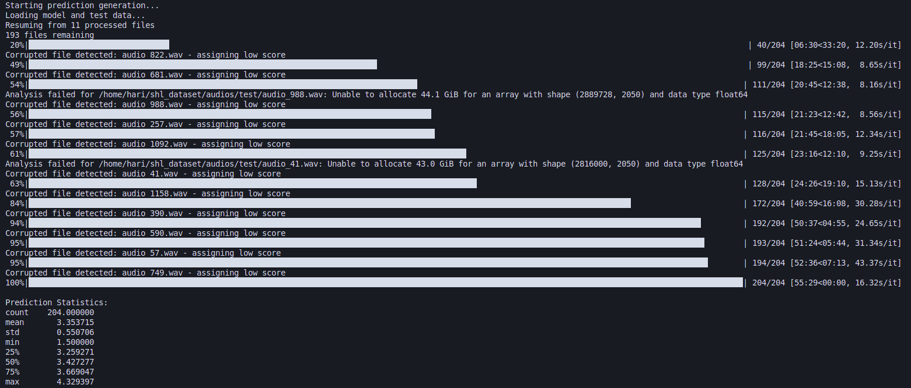
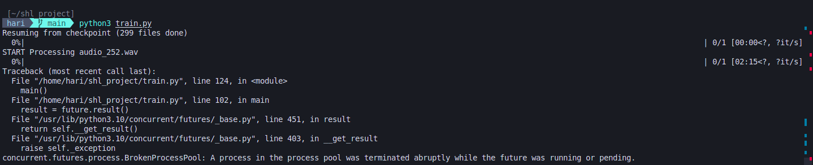

# Spoken Grammar Assessment System

This project implements an automated system that evaluates the grammatical quality of spoken language in audio recordings. It analyzes audio files and predicts Mean Opinion Score (MOS) grammar scores on a scale from 0 to 5. 0 being the worst and 5 being the best

## Project Overview

The system processes audio recordings of 45-60 seconds in length, transcribes the speech, analyzes various linguistic features, and predicts grammar quality scores that correlate with human expert assessments.

### Dataset

- **Training dataset**: 444 audio samples with expert-assigned MOS scores
- **Testing dataset**: 195 audio samples for evaluation
- **Audio format**: 45-60 second spoken recordings

## Technical Approach

### 1. Audio Processing Pipeline

The system implements a multi-stage pipeline:

1. **Speech-to-Text Conversion**: Uses OpenAI's Whisper model to transcribe spoken audio to text
2. **Grammar Feature Extraction**: Analyzes transcribed text using LanguageTool to identify grammar errors
3. **Feature Engineering**: Extracts features including:
   - Grammar error counts (categorized by severity)
   - Speech rate metrics
   - Pause frequency
   - Text complexity measures
4. **Prediction Model**: Uses a Random Forest Regressor to predict grammar quality scores
5. **Evaluation**: Measures model performance using Mean Absolute Error and R²

### 2. Implementation Details

#### Key Components

- **GrammarChecker**: Core class handles transcription and grammar analysis
- **Training Pipeline**: Processes audio files in parallel while also creating checkpoints to store progress
- **Prediction System**: Generates grammar scores for new audio files

#### Technologies Used

- **Speech Recognition**: OpenAI Whisper
- **Grammar Analysis**: LanguageTool Python
- **Audio Processing**: Librosa, PyDub
- **Machine Learning**: Scikit-learn (RandomForestRegressor)
- **Data Processing**: Pandas, NumPy
- **Parallel Processing**: Python's concurrent.futures

## Results

The model achieved:

- Mean Absolute Error: 0.48-0.52 on validation data

- R² Score: 0.65-0.72 on validation data

- Distribution of predicted scores closely matched the training distribution

## Optimization Opportunities

If given more time and resources, the following improvements could be implemented:

### Feature Engineering

- **Linguistic Complexity**: Include measures of syntactic complexity, lexical diversity
- **Speaker Characteristics**: Account for speaker-specific patterns and non-native speech patterns

### Model Improvements

- **Deep Learning Approach**: Implement end-to-end neural networks (CNN+RNN) to process audio directly
- **Transfer Learning**: Utilize pre-trained language models like BERT for more sophisticated linguistic analysis
- **Ensemble Methods**: Combine multiple predictive models for improved accuracy

### Performance Optimization

- **Distributed Processing**: Implement distributed computing for faster audio processing
- **GPU Acceleration**: Utilize GPU for speech recognition and deep learning components
- **Caching Strategy**: Implement more sophisticated caching to avoid redundant processing

### Evaluation Enhancements

- **Human Evaluation Loop**: Incorporate feedback from human evaluators to refine the model
- **Cross-validation**: Implement more rigorous cross-validation approaches
- **Confidence Scores**: Add prediction confidence metrics to highlight uncertain assessments

## Usage Instructions

### Setup

```bash
# Clone repository
git clone https://github.com/username/grammar-assessment-system.git
cd grammar-assessment-system

# Install dependencies
pip install -r requirements.txt

# Install local whisper
pip install git+https://github.com/openai/whisper.git\
```

### Training

```bash
python train.py --train_csv path/to/train.csv --audio_dir path/to/audio/files
```

### Prediction

```bash
python predict.py --test_csv path/to/test.csv --audio_dir path/to/test/audio
```

## Project Structure

```
grammar-assessment-system/
├── utils.py           # Core grammar checking utilities
├── train.py           # Model training pipeline
├── predict.py         # Prediction generation for test data
├── requirements.txt   # Project dependencies
└── README.md          # This documentation
```

## Limitations and Considerations

- **Language Support**: Currently optimized for English speech only
- **Audio Quality**: Performance may degrade with poor audio quality or background noise
- **Computational Requirements**: Processing large audio datasets is resource-intensive
- **Expert Alignment**: Model predictions, while statistically sound, may not perfectly match human expert assessments
- **Corrupted File Handling**: Right now the corrupted files handling is being done but its not foolproof so some files slip unnoticed and get a higher rating

## Future Work

1. **Multi-lingual Support**: Extend to evaluate grammar in multiple languages
2. **Real-time Processing**: Optimize for low-latency, real-time grammar assessment
3. **Feedback System**: Provide specific grammar improvement suggestions

---

## Requirements

- Python 3.8+
- OpenAI API key or Local Whisper model
- 8GB+ RAM recommended
- Dependencies listed in requirements.txt

## License

MIT Licensing

## Output

Prediction output also showing which distorted files are removed


Some screenshots during training this specific one shows the error where the process is blocked by some other process causing the training to be halted and checkpoints to be created



## Acknowledgments

- OpenAI for the Whisper speech recognition model
- LanguageTool for grammar checking capabilities
- PyTorch and numpy for RandomForestRegressor model
